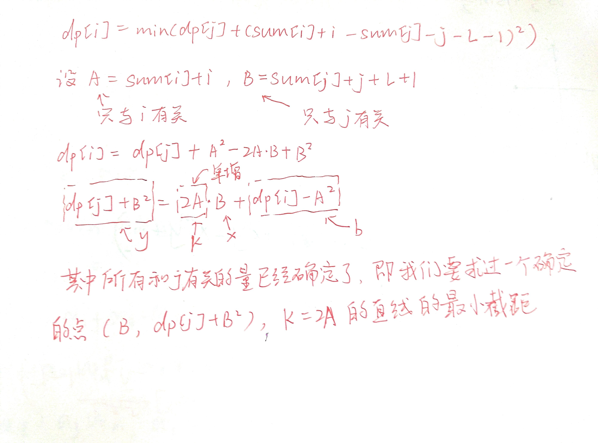

#斜率优化

$dp[i]=min(dp[j]+(sum[i]+i−sum[j]−j−L−1)2),i>j$


```c++
#include<iostream>
#include<cstdio>
#include<cmath>
#define maxn 50005
#define ll long long
using namespace std;
int q[maxn];
double A[maxn],B[maxn],dp[maxn],sum[maxn];
double X(int x){return B[x];}
double Y(int x){return dp[x]+B[x]*B[x];}
double slope(int a,int b){return (Y(a)-Y(b))/(X(a)-X(b));}
int main()
{
	int n,l;cin>>n>>l;
	for(int i=1;i<=n;i++)scanf("%lf",&sum[i]);
	for(int i=1;i<=n;i++)
	{
		sum[i]+=sum[i-1];
		A[i]=sum[i]+i;B[i]=sum[i]+i+l+1;
	}
	B[0]=l+1;//B[0]=sum[0]+0+l+1=l+1
	int tail=1,head=1;
	for(int i=1;i<=n;i++)
	{
		while(head<tail&&slope(q[head],q[head+1])<2*A[i])head++;
		int j=q[head];dp[i]=dp[j]+(A[i]-B[j])*(A[i]-B[j]);
        //why:dp[j]+B^2=2*A*B-A^2+dp[i];
		//    dp[i]=dp[j]+A^2+B^2-2*A*B=dp[j]+(A-B)(A-B)
		while(head<tail&&slope(i,q[tail-1])<slope(q[tail-1],q[tail]))tail--;
		q[++tail]=i;
	}
	printf("%lld",(ll)dp[n]);
	return 0;
}


```


```c++
#include<bits/stdc++.h>
using namespace std;
typedef long long ll;
const int N=1e5+9;
const int mod=1e9+7;
ll read(){
	ll ans=0,f=1;
	char c=getchar();
	while(c>'9'||c<'0'){
		if(c=='-')f=-1;
		c=getchar();
	}
	while(c<='9'&&c>='0'){
		ans=(ans<<3)+(ans<<1)+c-'0';
		c=getchar();
	}
	return ans*f; 
}
int n,m,ppp;
ll a[N],sum[N],d[N];
ll f[101][N];
struct Point{
	ll x,y;
	Point(ll _x=0,ll _y=0){
		x=_x;y=_y;
	}
	Point operator-(const Point a)const{
		return Point(x-a.x,y-a.y);
	}
	Point operator+(const Point a)const{
		return Point(x+a.x,y+a.y);
	}
	ll operator^(const Point a)const{
		return x*a.y-y*a.x;
	}
}p[N];


ll jud(int a,int b,int c){
	return (p[b]-p[a])^(p[c]-p[a]);
}
int now;
ll Y(int k){
	return sum[k]+f[now][k];
}

ll cul(int x,int k){
	return Y(x)-a[k]*x;
}


int hd,tl,q[N];
void solv(){
	n=read(),m=read(),ppp=read();
	for(int i=2;i<=n;i++){
		d[i]=d[i-1]+read();
	}
	for(int i=1;i<=m;i++){
		int id=read(),tim=read();
		a[i]=tim-d[id];
	}
	sort(a+1,a+1+m);
	for(int i=1;i<=m;i++){
		sum[i]=sum[i-1]+a[i];
	}
	for(int i=1;i<=m;i++){
		f[1][i]=i*a[i]-sum[i];
	}
	ll ans=f[1][m];
	for(int i=2;i<=ppp;i++){
		tl=0,hd=1;
		q[++tl]=0;
		now=i-1;
		for(int j=1;j<=m;j++){
			
			p[j].x=j;p[j].y=f[i-1][j]+sum[j];
			while(hd<tl&&cul(q[hd],j)>cul(q[hd+1],j)){
				hd++;
			}
			
			int k=q[hd];
			f[i][j]=f[i-1][k]-sum[j]+sum[k]+a[j]*(j-k);
			while(hd<tl&&jud(q[tl-1],q[tl],j)<=0){
				tl--;
			}
			
			q[++tl]=j;
		}
		ans=min(ans,f[i][m]);
	}
	printf("%lld\n",ans);
}

int main(){
	int tst=1;
	while(tst--){
		solv();
	} 
	return 0;
}

```